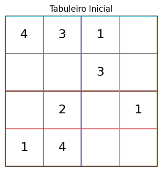
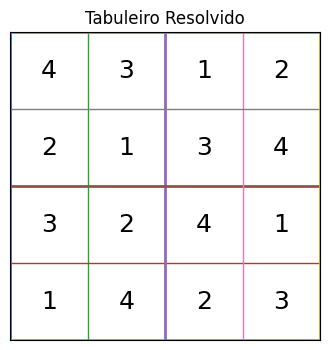

# Sudoku 4x4 com Rede Neural Artificial Multicamadas

Este projeto apresenta uma solução em Python usando uma Rede Neural Artificial (RNA) multicamadas para trabalhar com o quebra-cabeça Sudoku em uma grade 4x4.

A grade utiliza números do conjunto:

```text
S = {1, 2, 3, 4}
```

O Sudoku 4x4 é formado por:

- 4 linhas;
- 4 colunas;
- 4 subgrupos 2x2.

## Objetivo do projeto

O objetivo é propor uma solução usando RNA multicamadas para reconhecer tabuleiros válidos de Sudoku 4x4.

A RNA foi treinada para classificar tabuleiros completos como:

```text
0 = inválido
1 = válido
```

Além disso, o sistema gera um tabuleiro inicial aleatório com algumas células vazias, resolve esse tabuleiro e usa a RNA treinada para reconhecer se a solução final é válida.

## Regras consideradas

A solução considera as seguintes regras:

1. Cada célula deve conter apenas um número pertencente ao conjunto `S = {1, 2, 3, 4}`.
2. Nenhuma linha pode conter números repetidos.
3. Nenhuma coluna pode conter números repetidos.
4. Nenhum subgrupo 2x2 pode conter números repetidos.
5. Cada linha e coluna da grade principal 4x4 deve conter exatamente os números `1, 2, 3 e 4`.

## Estrutura do projeto

```text
sudoku-rna-4x4/
│
├── README.md
├── requirements.txt
│
├── src/
│   └── sudoku_rna_4x4.py
│
├── imagens/
│   ├── tabuleiro_inicial.png
│   └── tabuleiro_resolvido.png
│
└── notebooks/
    └── sudoku_rna_4x4.ipynb
```

## Tecnologias utilizadas

- Python
- NumPy
- Scikit-learn
- Matplotlib
- Rede Neural Artificial Multicamadas
- Backtracking

## Como executar o projeto

Primeiro, instale as dependências:

```bash
python -m pip install -r requirements.txt
```

Depois, execute o programa principal:

```bash
python src/sudoku_rna_4x4.py
```

## Funcionamento da solução

A solução usa uma abordagem híbrida.

A RNA não resolve o Sudoku diretamente como um ser humano resolveria. Ela aprende padrões a partir dos exemplos de treinamento e classifica tabuleiros completos como válidos ou inválidos.

A resolução do tabuleiro inicial é feita usando backtracking, pois o Sudoku é um problema de raciocínio lógico e satisfação de restrições.

O fluxo geral é:

```text
1. Gerar soluções válidas de Sudoku 4x4.
2. Gerar exemplos inválidos a partir de alterações nas soluções válidas.
3. Transformar os tabuleiros em vetores numéricos.
4. Treinar uma RNA multicamadas.
5. Gerar um tabuleiro inicial aleatório.
6. Resolver o tabuleiro usando backtracking.
7. Usar a RNA para reconhecer se a solução final é válida.
```

## Codificação dos dados

A RNA não recebe a matriz 4x4 diretamente. Cada célula é convertida usando codificação one-hot.

Exemplo:

```text
1 -> [1, 0, 0, 0]
2 -> [0, 1, 0, 0]
3 -> [0, 0, 1, 0]
4 -> [0, 0, 0, 1]
```

Como o Sudoku 4x4 possui 16 células e cada célula pode assumir 4 valores:

```text
16 x 4 = 64 entradas
```

Por isso, a entrada da RNA possui 64 atributos.

## Conjunto de dados

O programa gera automaticamente o conjunto de dados para treinamento e teste.

Na execução realizada, foram gerados:

```text
Total de exemplos: 576
Exemplos válidos: 288
Exemplos inválidos: 288
Tamanho da entrada da RNA: 64
```

Os dados foram separados em:

```text
Treino: 432
Teste: 144
```

## Resultado da execução

Após a execução do programa, foi gerado um tabuleiro inicial aleatório com algumas células vazias.

### Tabuleiro inicial



### Tabuleiro resolvido



## Saída obtida no terminal

```text
# Gerando dataset
Total de exemplos: 576
Exemplos válidos: 288
Exemplos inválidos: 288
Tamanho da entrada da RNA: 64

# Separando treino e teste
Treino: 432
Teste: 144

# Treinando RNA

# Avaliando RNA

Acurácia no teste: 0.6041666666666666

Relatório de classificação:
              precision    recall  f1-score   support

           0       0.65      0.44      0.53        72
           1       0.58      0.76      0.66        72

    accuracy                           0.60       144
   macro avg       0.62      0.60      0.59       144
weighted avg       0.62      0.60      0.59       144

Matriz de confusão:
[[32 40]
 [17 55]]

# Gerando tabuleiro inicial aleatório

Tabuleiro inicial
-------------
. 1 | 2 3
3 . | . 1
-------------
1 4 | . .
. 3 | . .

# Resolvendo tabuleiro

Solução gerada
-------------
4 1 | 2 3
3 2 | 4 1
-------------
1 4 | 3 2
2 3 | 1 4

# Reconhecimento pela RNA
Classe prevista: 1
Probabilidades [inválido, válido]: [0.00212075 0.99787925]
A RNA reconheceu o tabuleiro final como VÁLIDO.

Imagens salvas na pasta imagens/.
```

## Interpretação dos resultados

A RNA reconheceu a solução final como válida.

A saída:

```text
Classe prevista: 1
Probabilidades [inválido, válido]: [0.00212075 0.99787925]
```

indica que a rede classificou o tabuleiro como válido com probabilidade aproximada de:

```text
99,78%
```

Isso mostra que, para a solução final gerada, a RNA conseguiu reconhecer corretamente o padrão de um Sudoku válido.

## Limitação da RNA

A acurácia geral no conjunto de teste foi de aproximadamente 60%.

Isso mostra que a RNA, sozinha, não é suficiente para resolver Sudoku de forma totalmente confiável. A rede aprende padrões estatísticos, mas não garante raciocínio lógico completo.

Por esse motivo, a solução usa uma abordagem híbrida:

```text
Backtracking para resolver o tabuleiro
RNA para reconhecer/classificar a solução final
```

## Discussão sobre geração de amostras

Um problema importante é que gerar amostras aleatórias e testá-las pode funcionar apenas em casos pequenos.

No Sudoku 4x4, existem 16 células e 4 possibilidades por célula:

```text
4^16 = 4.294.967.296 possibilidades
```

Mesmo em uma grade pequena, o número de combinações possíveis já é muito grande.

Em um Sudoku 9x9, o espaço de busca seria:

```text
9^81 possibilidades
```

Isso torna inviável resolver o problema apenas por tentativa e erro em grades maiores.

Portanto, o Sudoku deve ser tratado como um problema de raciocínio lógico e satisfação de restrições, e não apenas como um problema de geração e teste de amostras.

## Dificuldade de generalização para NxN

Ao generalizar de 4x4 para NxN, surgem algumas dificuldades.

Em uma grade 4x4, a entrada da RNA possui:

```text
4^3 = 64 atributos
```

Para uma grade NxN, usando one-hot, a entrada teria:

```text
N^3 atributos
```

Isso acontece porque existem:

- `N²` células;
- `N` valores possíveis para cada célula.

Logo:

```text
N² x N = N³
```

Além disso, o número de combinações cresce exponencialmente conforme N aumenta.

Por isso, uma solução genérica para Sudoku NxN deve combinar RNA com outros métodos, como:

- regras lógicas;
- backtracking;
- heurísticas;
- programação por restrições;
- algoritmos de busca.

## Conclusão

O projeto demonstra o uso de uma RNA multicamadas para classificar tabuleiros de Sudoku 4x4 como válidos ou inválidos.

A solução também mostra que, embora a RNA possa reconhecer padrões, ela não substitui completamente o raciocínio lógico necessário para resolver o Sudoku.

Assim, a abordagem mais adequada é combinar técnicas de Inteligência Artificial baseadas em aprendizado de máquina com algoritmos clássicos de busca e satisfação de restrições.

## Equipe

- Integrante 1:Marinaldo de Souza Castro júnior
- Integrante 2:Laysa Siqueira da Silva
- Integrante 3:Rebeca Agra Dangelo Bastos
